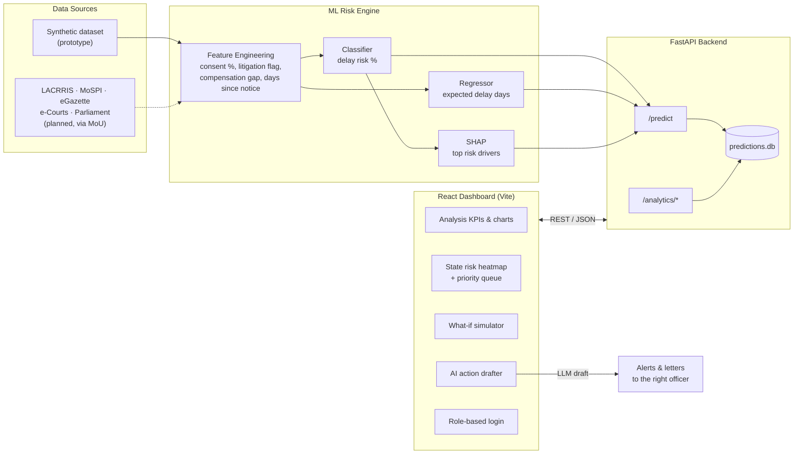

# DrishtiPulse: AI Early-Warning System for Land Acquisition Delays

Smart India Hackathon 2026 · Problem Statement SIH26017 · Team CodeCrafterz

Predicts delay risk for land acquisition cases, explains why using SHAP,
and shows state-wise bottlenecks on an interactive heatmap so officers know
which cases to review first.

## Features
- ML risk engine (XGBoost / Random Forest) with SHAP explanations
- Analytics dashboard and state-level risk heatmap
- Priority queue of high-risk cases by sector
- What-if simulator and AI action drafter

## Architecture

DrishtiPulse is a three-layer system: a React dashboard, a FastAPI service that
serves predictions and analytics, and an ML engine that scores every case for
delay risk and explains the score.




## Tech stack
React + Vite, FastAPI, XGBoost, SHAP, SQLite/PostgreSQL

## Run locally
Backend:
    cd DrishtiPulse
    python -m venv venv
    venv\Scripts\activate
    pip install -r requirements.txt
    python train_model.py        # only if models/ is missing
    python seed_predictions.py   # creates predictions.db
    uvicorn api:app --reload --port 8000

Frontend (second terminal):
    cd web
    npm install
    npm run dev

Open http://localhost:5173

### Project structure

```
predictland-ml/
├── DrishtiPulse/            # Backend and ML
│   ├── api.py               # FastAPI app and analytics endpoints
│   ├── train_model.py       # Trains and saves the models
│   ├── seed_predictions.py  # Fills predictions.db from the dataset
│   ├── models/              # Trained model files
│   ├── data/                # Synthetic dataset
│   └── requirements.txt
└── web/                     # Frontend
    ├── public/
    │   └── india-states.json   # State boundaries for the heatmap
    └── src/
        ├── components/         # RiskHeatmap, AIActionDrafter, LoginModal
        ├── App.jsx
        └── main.jsx
```

## Data note
Real land acquisition case records are legally sensitive and access-restricted.
This prototype uses a synthetic dataset modelled on public research (PRAGATI,
LACRRIS). Risk scores are decision-support aids, not legal determinations.